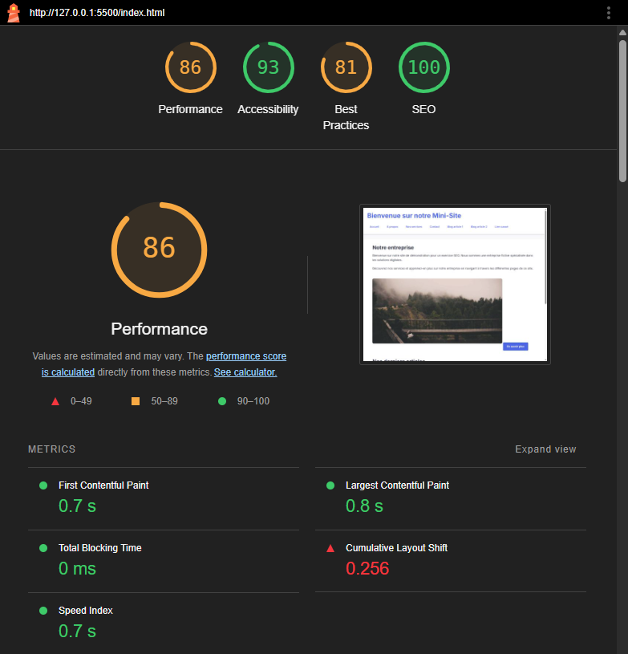
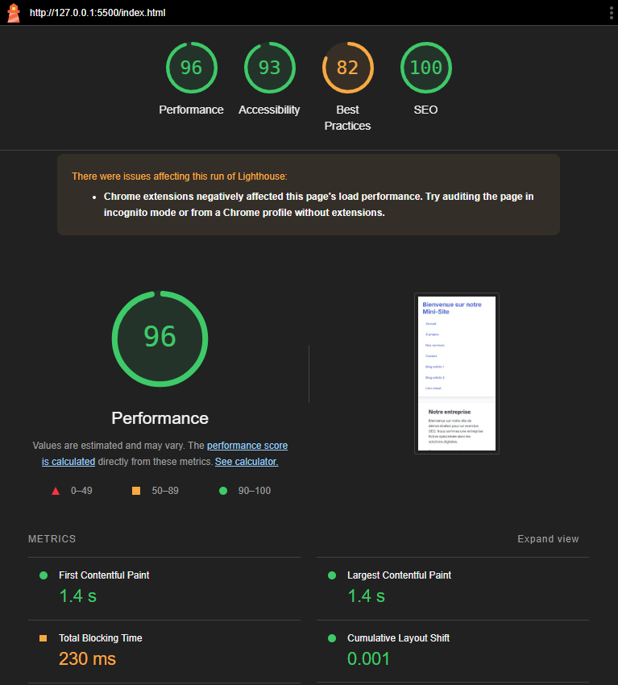
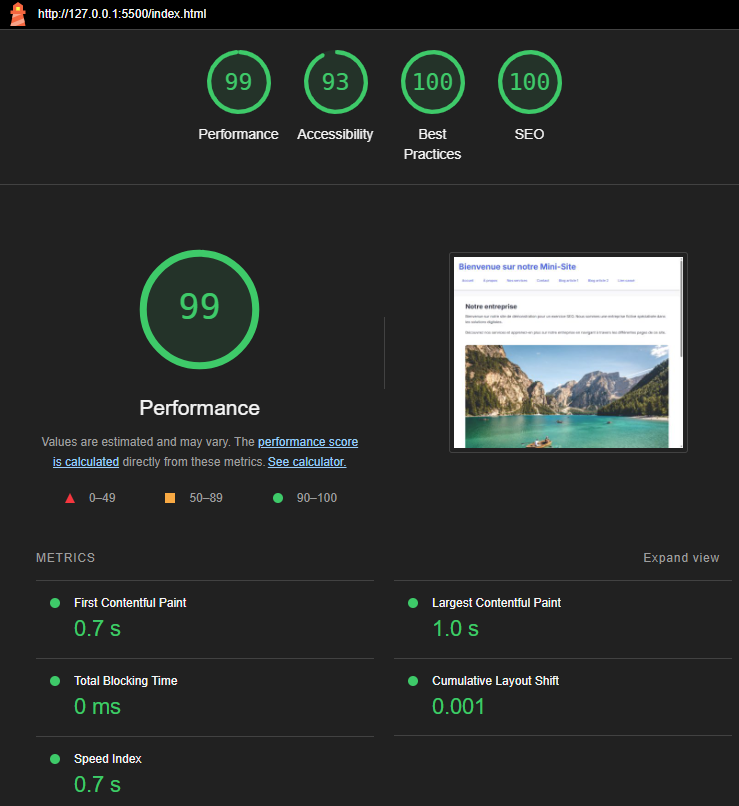
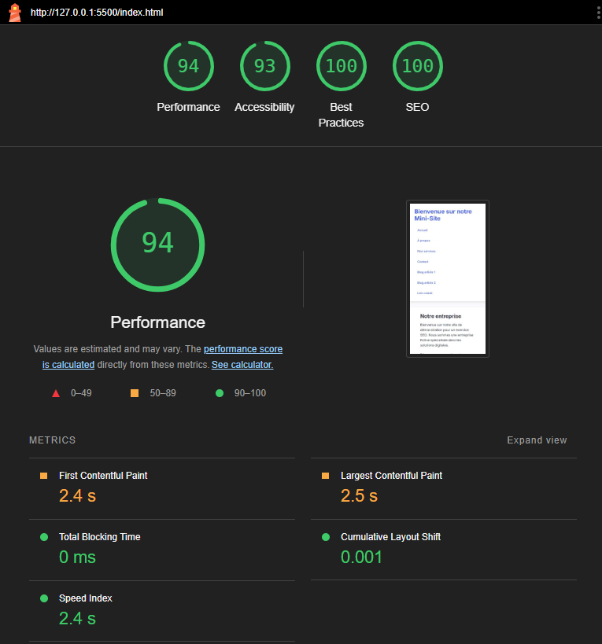

# 🔧 **Exercice 1 – Créer un Mini-Site HTML SEO-Friendly**

### 🎯 Objectif :

Concevoir un mini-site web statique, structuré de manière à être **explorable par un moteur de recherche**, et **référencement-friendly**. Ce site servira ensuite de base pour être analysé par un mini-crawler que vous développerez dans un second temps.

---

### 🧱 Contraintes techniques du mini-site :

- Le site doit être en **HTML/CSS pur** (pas de framework).
- Il doit contenir entre **5 et 7 pages internes**, liées entre elles.
- Toutes les pages doivent être **accessibles depuis la page d’accueil**.
- Inclure une **navigation principale** (header/menu).
- Utiliser une **structure sémantique HTML5 correcte** :
  - `<header>`, `<main>`, `<footer>`, `<nav>`, `<article>`, etc.
- Ajouter des **balises SEO importantes** :
  - `<title>`, `<meta name="description">`
  - Une seule balise `<h1>` par page
  - Des images avec `alt`

---

### 💡 Contenu recommandé :

- Une page d’accueil (`index.html`)
- Une page "À propos"
- Une page "Nos services"
- Une page "Contact"
- Une ou deux pages de blog ou articles

---

### ⚠️ Pièges SEO à intégrer volontairement :

Pour préparer le travail du mini-crawler, vous devez volontairement insérer :

- Au moins **1 lien cassé** (`href="page-qui-nexiste-pas.html"`)
- Une page avec **balise `<title>` manquante**
- Une page sans `<meta description>`
- Un lien **vers un site externe**

---

### 🗂️ Organisation recommandée :

```
/mon-mini-site
  ├── index.html
  ├── about.html
  ├── services.html
  ├── contact.html
  ├── blog/
  │   ├── article1.html
  │   └── article2.html
  └── css/
      └── style.css
```

---

Une fois le site prêt, vous pourrez l’ouvrir localement avec un serveur simple :

```bash
npx http-server ./mon-mini-site
```

---

# 🧪 **TP 2 – Développement d’un Mini-Crawler Node.js + Sitemap**

### 🎯 Objectif :

Créer un **mini crawler web** en Node.js capable d’explorer automatiquement votre mini-site local, d’identifier les pages internes accessibles, et de générer un **fichier sitemap.xml** dynamique pour le référencement.

> Ce TP se fait en **travail individuel**.

---

### 🛠️ Fonctionnalités attendues du script :

1. **Explorer récursivement les pages internes**

   - Démarrer depuis une URL de base (ex : `http://localhost:8080`)
   - Suivre les liens internes (`<a href>` avec des chemins relatifs)
   - **Ignorer les liens externes, ancres, fichiers (.jpg, .pdf, .zip, etc.)**
   - **Éviter les boucles** et les pages déjà visitées

2. **Générer un `sitemap.xml`**
   - Respecter la structure standard :
     ```xml
     <urlset xmlns="http://www.sitemaps.org/schemas/sitemap/0.9">
       <url>
         <loc>http://localhost:8080/page.html</loc>
         <changefreq>weekly</changefreq>
         <priority>0.8</priority>
       </url>
     </urlset>
     ```
   - Le fichier doit inclure **uniquement les pages valides** trouvées pendant le crawl
   - Enregistrer le fichier à la racine du projet

---

### 💻 Structure du projet recommandée :

```
/mini-crawler
  ├── crawler.js
  ├── sitemap.xml
  └── package.json
```

---

### 💡 Aide au démarrage :

#### 📦 Installation des dépendances :

```bash
npm init -y
npm install axios cheerio xml minimist
```

#### 🔁 Algorithme de base :

1. Créer une `Set` pour suivre les pages déjà visitées
2. Utiliser `axios` pour charger chaque page
3. Parser les balises `<a>` avec `cheerio`
4. Filtrer les URLs valides internes
5. Appeler récursivement la fonction `crawl()` pour chaque lien trouvé

---

🧪 Exemple de commande :

```bash
node crawler.js --url=http://localhost:8080 --maxDepth=2
```

---

📣 **Conseil** : testez votre `sitemap.xml` ici →  
👉 [https://www.xml-sitemaps.com/validate-xml-sitemap.html](https://www.xml-sitemaps.com/validate-xml-sitemap.html)

## 📈 Liste des optimisations réalisées

### Optimisations SEO

- Utilisation de balises sémantiques HTML5 (`<header>`, `<main>`, `<footer>`, `<nav>`, `<article>`, `<section>`)
- Structure hiérarchique des titres correcte (h1, h2, h3)
- Balises meta description présentes sur les pages principales
- Attributs alt descriptifs sur les images
- URLs propres et descriptives
- Navigation claire et accessible

### Optimisations Performance

- Utilisation de `preconnect` pour les polices Google Fonts
- Chargement différé des images avec `loading="lazy"`
- CSS optimisé et minifié
- Utilisation de variables CSS pour une maintenance facilitée
- Images au format WebP pour un meilleur rendement
- Design responsive avec media queries

### Optimisations UX/UI

- Interface utilisateur moderne et épurée
- Animations subtiles pour améliorer l'interaction
- Système de grille flexible pour les articles
- Design responsive adapté aux mobiles
- Contraste des couleurs optimisé pour l'accessibilité
- Transitions fluides pour les interactions

### Optimisations Code

- Structure de projet claire et organisée
- Code HTML bien indenté et commenté
- Utilisation de classes CSS réutilisables
- Système de design cohérent avec variables CSS
- Gestion des états hover et focus
- Support des navigateurs modernes

## 🖼️ Liens des images

### Rapport initial Lighthouse (Desktop)

- 

### Rapport initial Lighthouse (Mobile)

- 

### Rapport après optimisation du code (Desktop)

- 

### Rapport après optimisation du code (Mobile)

- 
